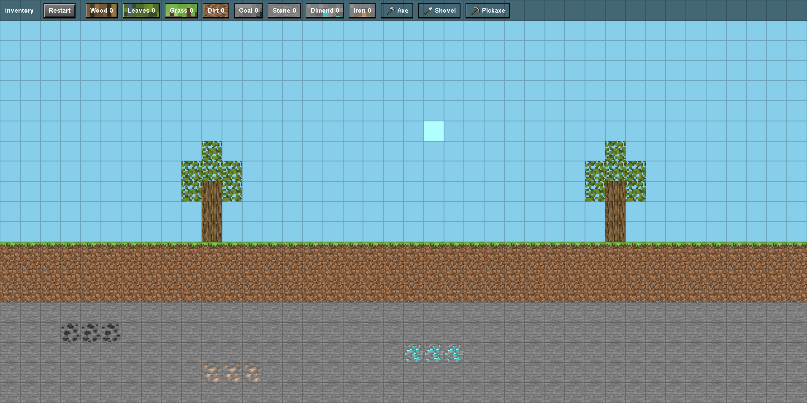

# 2d-Minecraft

Mini Minecraft 2D is a small browser-based mining game built with HTML, CSS, and JavaScript. It lets you explore a simple block world, break blocks, collect resources, and use a lightweight inventory system.

## Preview

## What the project includes

- A 2D world made from blocks
- Mining and placing blocks
- An inventory with block items and tools
- Tool-based breaking rules for wood, leaves, grass, dirt, coal, and stone
- A restart button to reset the game world

## How to run

1. Click blocks to mine them.
2. Use the inventory buttons to select a block or tool.
3. Right-click on empty space to place the selected block.
4. Click the Restart button to start over.

## Controls

- Left click: break a block
- Right click: place the selected block
- Inventory buttons: choose a block or tool
- Restart: reset the world

## Project structure

The project is organized into three main folders:

- `co/` — the main game page, styles, and gameplay logic
- `loadingScreen/` — the loading screen experience
- `startscreen-done/` — the start screen interface

## Notes

This project is intentionally simple and easy to expand. You can add new blocks, improve the terrain, or build more advanced gameplay features.

